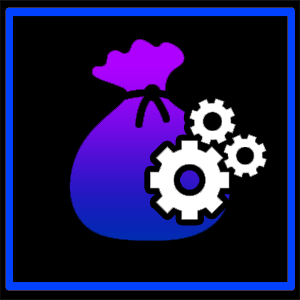

[](https://github.com/Jukkales/HoardFarm/actions/workflows/build-plugin.yml)
[]()
[]()
[]()

[](https://discord.gg/Zzrcc8kmvy)
# Hoard Farm
```
https://puni.sh/api/repository/jukka
```
**YOU WILL NEEED [vnavmesh](https://github.com/awgil/ffxiv_navmesh) FOR THIS!**
Check the [Installation Guide](https://github.com/Jukkales/HoardFarm/blob/main/INSTALL.md) for more information.
---



Overwhelmed that you have to find 20000 hoards to get "For the Hoard VI"?

It takes ages if you run DeepDungeons normal and even if farmed specifically, it still takes hundreds of hours.


This little assistant will help you getting the achievement faster _(by doing it for you)_.

<p style="clear: both"></p>

---

## Features
- Fully automatic hoard farming
- Moves to HoH
- Enters HoH
- Searches and Move to Hoards
- Leaves and repeat
- ... oh and statictics!
- Being imperfect

---
## Usage

You need to have an prepared Heaven on High Save at Floor 11 or 21 with at least **one Pomander of Intuition** and **one Pomaner of Concealment**.
Having more Pomanders of Concealment makes it more safe, but is not required. The Plugin can also use Pomander of Safety and Magicites when Vanish runs out.

Just select your save slot, hit start and watch it running. It will stop one it reaches you selected stop condition.


---
### Educational Purpose

I mainly created this plugin for me to learn whats possible and how to do it. 
I like to learn and understanding things deeply, especially automation.
This plugin is not intended to be used for botting.
Somehow i can understand to use it because 20000 hoards is way over the top what SE should ask for an achievement.

Personally i dont care if you bot trough the game _(and even SE dont care as long you dont make videos of it lol)_.

I'm not responsible for any bans or anything else that could happen to you. (really, dont make videos of it or stream it)

---
_Special thanks to Leonhart for making the icon!_
